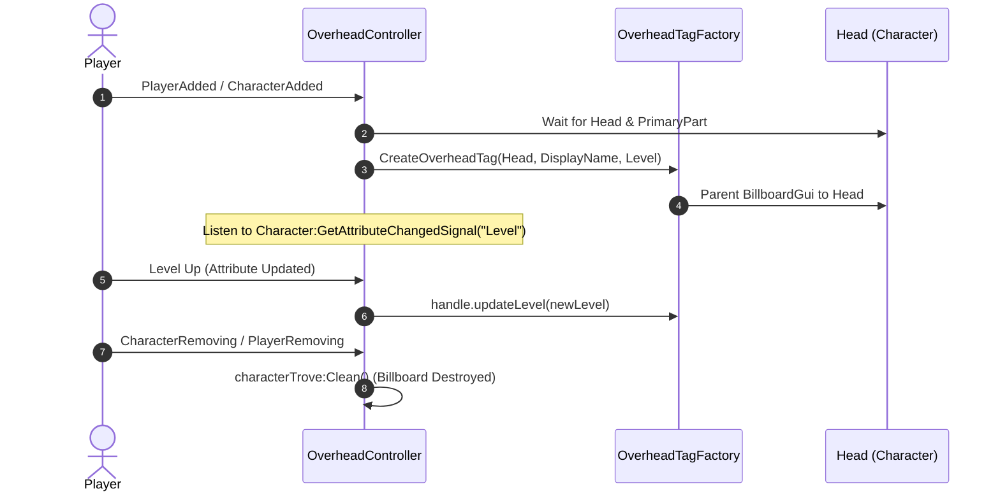

# 🏷️ UI Specification: Player Overhead Tag (`OverheadTagFactory`)

Dokumen ini menjelaskan spesifikasi lengkap, struktur visual, hierarki objek, dan integrasi controller untuk komponen **Player Overhead Tag (Nama & Level di Atas Kepala)**.

---

## 📌 Lokasi File Sumber
- **Factory / Renderer:** `src/client/UI/Common/OverheadTagFactory.luau`
- **Controller:** `src/client/Controllers/OverheadController.luau`
- **Tipe Data / Handle:** `export type OverheadTagHandle`

---

## 🎨 Gambaran & Desain Visual
- **Fungsi:** Menampilkan Display Name pemain dan status Level karakter secara langsung di atas kepala karakter di dunia 3D.
- **Tampilan:**
  - **Baris 1 (Atas):** Display Name pemain (Warna putih bersih dengan outline hitam tajam & halus).
  - **Baris 2 (Bawah):** Indikator Level (Warna kuning emas cerah `Lv. X` tanpa outline berlebih untuk tampilan clean & modern).
- **Behavior:**
  - Terpasang pada `Head` karakter menggunakan `BillboardGui`.
  - Reaktif: Mengupdate teks level secara live saat Attribute `Level` pada karakter berubah.
  - Memori aman: Dibersihkan otomatis menggunakan `Trove` saat karakter respawn atau player meninggalkan server.

---

## 🏗️ Hierarki Objek UI (Tree Structure)

```
BillboardGui (Name: "OverheadTag", Size: 4.5 x 1.4 studs, StudsOffset: (0, 3.0, 0))
 └── Container (Frame - BackgroundTransparency: 1)
      ├── UIListLayout (FillDirection: Vertical, Alignment: Center)
      │
      ├── NameLabel (TextLabel - Player Display Name)
      │    └── UIStroke (Color: #000000, Thickness: 1.3, LineJoinMode: Round)
      │
      └── LevelLabel (TextLabel - "Lv. X")
```

---

## 📐 Properti Detail Setiap Elemen

### 1. `BillboardGui` (Root 3D Billboard)
| Properti | Nilai | Deskripsi |
| :--- | :--- | :--- |
| `Adornee` | `Character.Head` | Terkunci pada kepala karakter |
| `Size` | `UDim2.new(4.5, 0, 1.4, 0)` | Ukuran proporsional di dunia 3D |
| `StudsOffset` | `Vector3.new(0, 3.0, 0)` | Jarak 3.0 studs di atas kepala |
| `AlwaysOnTop` | `false` | Realistis (dapat terhalang objek dunia) |
| `MaxDistance` | `65` studs | Menghindari clutter saat jarak jauh |
| `LightInfluence` | `0` | Warna teks selalu terang & kontras |
| `ResetOnSpawn` | `false` | Diatur melalui lifecycle controller |

---

### 2. `NameLabel` (Top Line - Player Display Name)
| Properti | Nilai | Deskripsi |
| :--- | :--- | :--- |
| `LayoutOrder` | `1` | Berada di baris atas |
| `Size` | `UDim2.new(1, 0, 0.41, 0)` | Tinggi 41% dari container |
| `Font` | `Enum.Font.FredokaOne` | Rounded & playful |
| `TextColor3` | `Color3.fromRGB(255, 255, 255)` | Putih solid |
| `TextScaled` | `true` | Skala dinamis |
| `BackgroundTransparency` | `1` | Transparan |

- **`UIStroke` (Name Outline)**:
  - `Color`: `Color3.fromRGB(0, 0, 0)` (Hitam pekat).
  - `Thickness`: `1.3`
  - `LineJoinMode`: `Enum.LineJoinMode.Round` (Menghilangkan artefak render retak/tajam).

---

### 3. `LevelLabel` (Bottom Line - Level Text)
| Properti | Nilai | Deskripsi |
| :--- | :--- | :--- |
| `LayoutOrder` | `2` | Berada di baris bawah |
| `Size` | `UDim2.new(1, 0, 0.26, 0)` | Tinggi 26% dari container (lebih kecil 40%) |
| `Font` | `Enum.Font.FredokaOne` | Serasi dengan font nama |
| `TextColor3` | `Color3.fromRGB(255, 217, 0)` | Kuning Emas Cerah |
| `Text` | `"Lv. %d"` | Format level pemain |
| `TextScaled` | `true` | Skala otomatis |
| `BackgroundTransparency` | `1` | Transparan |

---

## 🔄 Lifecycle & State Management


