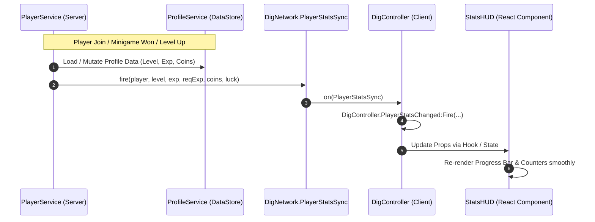

# 📊 UI Specification: Stats & Level HUD (`StatsHUD`)

Dokumen ini menjelaskan spesifikasi lengkap, struktur visual, hierarki Roact/Roblox, dan integrasi networking untuk komponen **Bottom-Left Stats HUD (Level, EXP Bar, Coins, dan Luck % Indicator)**.

---

## 📌 Lokasi File Sumber
- **Komponen React-Luau:** `src/client/UI/Components/StatsHUD.luau`
- **Mount & Lifecycle:** `src/client/UI/App.luau`
- **Data & Sync Event:** `src/client/Controllers/DigController.luau` (`PlayerStatsChanged` Signal)
- **Networking Network:** `src/shared/Network/DigNetwork.blink` (`PlayerStatsSync`)

---

## 🎨 Gambaran & Desain Visual
- **Fungsi:** Menampilkan status persisten pemain meliputi Level saat ini, EXP progress bar menuju level berikutnya, jumlah Koin, serta indikator Bonus Luck dari leveling.
- **Posisi:** Sudut kiri bawah layar (`Position = UDim2.new(0, 20, 1, -20)`, `AnchorPoint = Vector2.new(0, 1)`).
- **Desain & Gaya:**
  - Glassmorphism Gelap (`#0F1523` dengan transparansi `0.25`).
  - 3D Procedural Stroke & Bevel Accent (`#385078` dan `#0A0E18`).
  - Neon Level Badge bersudut dengan gradient emas & cyan.
  - EXP Progress Bar dengan highlight gloss di bagian atas fill.

---

## 🏗️ Hierarki Objek UI (Tree Structure)

```
ScreenGui (Name: "StatsHUD_ScreenGui", DisplayOrder: 5, ResetOnSpawn: false)
 └── RootContainer (Frame - Posisi Sudut Kiri Bawah)
      ├── UIListLayout (FillDirection: Vertical, Padding: 6px)
      │
      ├── TopRow (Frame - LayoutOrder 1: Coins & Luck)
      │    ├── CoinCard (3D Procedural Bevel)
      │    │    ├── Shadow (Bottom Darkened Layer)
      │    │    └── Face (Elevated Surface Layer, ClipsDescendants = true)
      │    │         ├── UICorner (CornerRadius: 6px)
      │    │         ├── UIStroke (Thickness: 1.5px, Color: #F1C40F)
      │    │         ├── Shine (Glossy Specular UIGradient, Height: 45%)
      │    │         └── CoinText (TextLabel - "🪙 12,450")
      │    │
      │    └── LuckCard (3D Procedural Bevel)
      │         ├── Shadow (Bottom Darkened Layer)
      │         └── Face (Elevated Surface Layer, ClipsDescendants = true)
      │              ├── UICorner (CornerRadius: 6px)
      │              ├── UIStroke (Thickness: 1.5px, Color: #2ECC71)
      │              ├── Shine (Glossy Specular UIGradient, Height: 45%)
      │              └── LuckText (TextLabel - "🍀 115%")
      │
      └── BottomRow (Frame - LayoutOrder 2: Stylized 3D Capsule Tube EXP Bar)
           ├── TrackContainer (Capsule Tube, UICorner: 1, 0, UIStroke: #0E1219)
           │    └── TrackBed (Hollow Dark Inset Bed, UICorner: 1, 0)
           │         ├── ExpFill (Cyan Glass Capsule, Gradient: #3DF6FF -> #0088DD)
           │         │    ├── GlassGloss (Upper Curved Specular Highlight)
           │         │    └── EdgeSheen (Top White Glow Rim)
           │         └── ExpLabel (TextLabel - "182 / 579")
           │
           └── LevelBadge (Protruding Left 3D Lime Green Badge, ZIndex: 10)
                ├── UIStroke (Thickness: 2.5px, Color: #0C1016)
                ├── BadgeShadow (Bottom Forest Green Extrusion Layer)
                └── BadgeFace (Top Lime Gradient Layer: #B5FA22 -> #68C810)
                     ├── BadgeShine (Upper Specular Gloss)
                     └── LevelText (TextLabel - "LV. 3", White with dark stroke)
```

---

## 📐 Spesifikasi Properti & Data Binding

### 1. Reaktif State (`DigController.PlayerStatsChanged`)
Komponen mendengarkan sinyal event dari client controller:
```luau
type PlayerStats = {
    level: number,
    exp: number,
    requiredExp: number,
    coins: number,
    luckMultiplier: number,
}
```

### 2. Rumus Progres EXP Fill
$$\text{Progress Fill} = \text{math.clamp}\left(\frac{\text{Current EXP}}{\text{Required EXP}}, 0, 1\right)$$

- **Required EXP Formula:**
  $$\text{Required EXP}(\text{level}) = \lfloor 100 \times \text{level}^{1.6} \rfloor$$

- **Luck Formula (Base 100 at Level 1 + Scaling Level % + Shovel %):**
  $$\text{Player Luck Score} = 100 + \text{LevelBonusLuck}(\text{level}) + \text{ShovelLuckBonus}$$
  $$\text{Player Luck Multiplier} = \frac{\text{Player Luck Score}}{100}$$
  - **Level 1–10:** Naik dari $+0\%$ s/d $+100\%$ ($\approx +11.11\%$ per level).
  - **Level 10–100:** Naik dari $+100\%$ s/d $+900\%$ ($\approx +8.89\%$ per level $\rightarrow 10.0\times$ base).
  - **High-Tier Shovel:** Memberikan bonus hingga $+500\%$ Luck ($+5.0\times$).
  - *Contoh:*
    - Level 1 (Starter Sekop $+15\%$) = **$115\%$** ($1.15\times$).
    - Level 10 (Stone Sekop $+60\%$) = **$260\%$** ($2.60\times$).
    - Level 50 (Diamond Sekop $+380\%$) = **$930\%$** ($9.30\times$).
    - Level 100 (Mythic Celestial Sekop $+500\%$) = **$1500\%$** ($15.0\times$).

---

## 🔄 Alur Sinkronisasi Data (Sequence Diagram)


